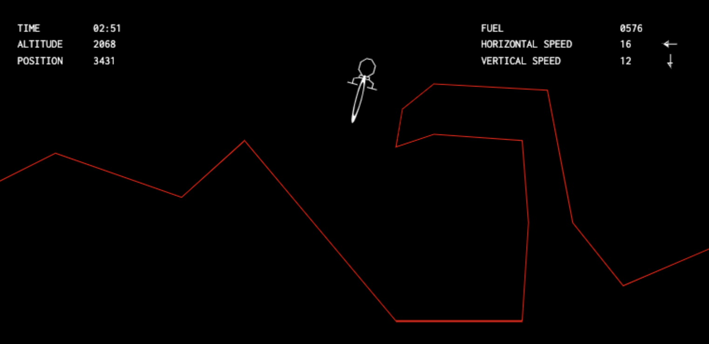
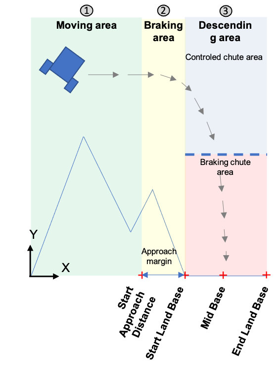

# Mars_lander_codingame
The goal of the program is to safely land the "Mars Lander" shuttle on Mars surface.

https://www.codingame.com/training/expert/mars-lander-episode-3

    

Après avoir trouvé l’emplacement de la plateforme d’atterrissage, « le séquence manager » détermine le comportement du vaisseau en fonction de sa position et de sa vitesse dans l’espace 2D.
Le vaisseau est piloté grâce à la puissance des moteurs et son orientation dans l’espace. Les différentes phases de vol sont définies sur la figure ci-dessous.

    

 
        <h1 style="color: green">GeeksforGeeks</h1> 
        <h3>Embedding the PDF file Using Object Tag</h3> 
        <object data= "report_C.pdf" 
                width="800"
                height="500"> 
        </object> 
    
 